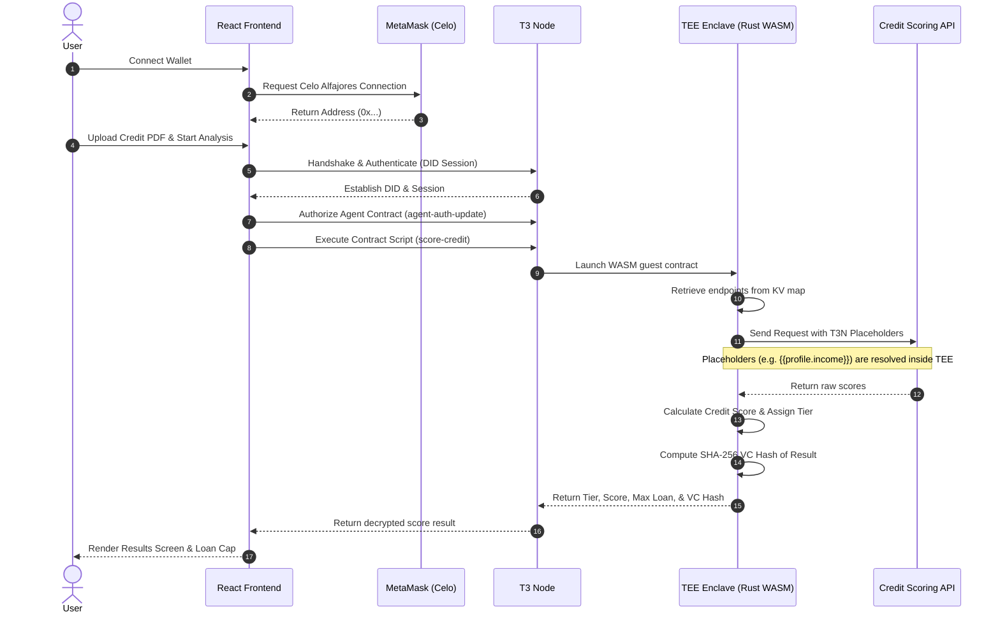

# PrivyLend 🛡️ Celo + Terminal 3 DeFi Credit Agent

**PrivyLend** is a privacy-first, decentralized credit scoring agent built on Celo using Terminal 3's **T3 Agent Dev Kit (ADK)**. 

It allows borrowers to calculate their financial creditworthiness and obtain verifiable loan limits on-chain without exposing their raw bank statements, payslips, or personal identifiable information (PII) to lenders or third-party APIs. All sensitive computations run verifiably inside hardware-secured **Trusted Execution Environments (TEEs)**.

---

## 🚀 Key Features

*   **Secure TEE Enclave Execution**: The credit rating calculations are processed inside a secure TEE enclave running a custom Rust WASM guest contract.
*   **Privacy-Preserving Placeholders**: Integrates T3's `http-with-placeholders` API, allowing the agent to fetch external data using client-side replacements (e.g. `{{profile.monthly_income}}`) directly inside the enclave, preventing raw statements from ever leaking.
*   **Verifiable Credentials (VC)**: Generates a secure SHA-256 cryptographic hash of the credit score inside the enclave and issues a VC to authenticate loan limits on Celo.
*   **Decentralized Wallet Authentication**: Connects with MetaMask (Celo Alfajores Testnet) to authenticate sessions using `metamask_sign` and establish DID identities.
*   **Judge-Friendly Sandbox Mode**: Includes a local developer bypass and sandbox pipeline trigger so the application's UI flow can be fully evaluated even in clean browser environments without MetaMask or live T3 node configs.

---

## 🗺️ Architectural Flow

The diagram below details how the User, Frontend, MetaMask, Celo Blockchain, T3 Node, and TEE Enclave interact:



---

## 📂 Directory Layout

```text
privylend/
├── frontend/             ← React + Vite App (TypeScript + Tailwind v3)
│   └── src/
│       ├── pages/        ← LandingPage.tsx, Dashboard.tsx, ResultsPage.tsx
│       ├── components/   ← WalletConnect.tsx, UploadForm.tsx, ScoreBadge.tsx, AuditLog.tsx
│       ├── agent/        ← t3Client.ts (DID Setup), agentFlow.ts (TEE Pipeline Orchestration)
│       └── hooks/        ← useWallet.ts (MetaMask), useT3Session.ts (State Manager)
├── tee-contract/         ← Rust Guest Contract Crate (compiled to WASM guest component)
│   ├── src/
│   │   ├── lib.rs        ← WIT-bindgen generate & guest guest interface dispatch
│   │   ├── score.rs      ← Core scoring logic, secrets self-seeding, & placeholder fetcher
│   │   └── vc_issue.rs   ← SHA-256 result hashing helper
│   └── wit/              ← WIT dependencies representing host interfaces
├── scripts/              ← TypeScript Node Setup Scripts
│   ├── setup-tenant.ts   ← Claims DID, creates KV secrets map, & seeds endpoints
│   └── register-contract.ts ← Compiles and registers WASM guest to the T3 node registry
├── package.json          ← Root npm workspace dependencies
└── tsconfig.json         ← Root tsconfig for registration script compile
```

---

## ⚙️ Environment Configuration

Create a `.env` file in the root folder (or duplicate the environment setup into `frontend/.env`):

```env
# The private hex key of the tenant address registered on the T3 testnet
VITE_T3N_API_KEY=your_key_here

# Celo Alfajores RPC provider endpoint
VITE_CELO_RPC=https://alfajores-forno.celo-testnet.org

# Registered script identifier on the T3 node
VITE_TENANT_SCRIPT=z:<your_tenant_id>:privylend-contract
```

---

## 🛠️ Quickstart Instructions

### 1. Compile the Rust WASM TEE Contract
Ensure you have the Rust toolchain installed, then target WASI WebAssembly compilation:

```bash
rustup target add wasm32-wasip2
cd tee-contract
cargo build --target wasm32-wasip2 --release
```
The compiled target artifact will be located at:
`tee-contract/target/wasm32-wasip2/release/z_privylend.wasm`

### 2. Run Tenant Setup and Registration
Run the TypeScript automation scripts to configure your tenant details on the T3 node:

```bash
# Install root dependencies
npm install

# Setup DID profile and create KV secrets mappings
npx ts-node --esm scripts/setup-tenant.ts

# Register the compiled WASM component binary to the node registry
npx ts-node --esm scripts/register-contract.ts
```

### 3. Launch the Local Development Server
Start the frontend development server:

```bash
# Run from the root directory using workspaces
npm run dev
```
Navigate your browser to **[http://localhost:5173/](http://localhost:5173/)** to access the web portal.

---

## 🧪 Testing in Sandbox Mode (MetaMask-free)

To enable friction-free testing for hackathon judges and evaluators who may not have a live T3 node or MetaMask browser configuration:

*   **MetaMask Bypass**: If MetaMask is not present, clicking *Connect MetaMask* automatically connects a mock developer wallet (`0x7099...79C8`) to let you proceed to the dashboard.
*   **TEE Sandbox Mode**: If `VITE_T3N_API_KEY` is not set or set to `your_key_here`, the pipeline will execute in sandbox mode, showing the live progress stages and generating mock credit rating results based on the uploaded document type.
*   **Dashboard Fallback**: If the live Celo node returns a network error (like a 401 Session Not Found due to CORS), the dashboard will display a red alert box containing a **"Switch to Sandbox Mode (Simulation)"** button to bypass the error and check out the rest of the application flow.